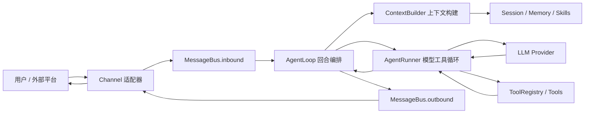

# nanobot 项目学习指南

这份文档面向第一次接触后端、异步 Python、Agent 框架或大模型工具调用的新同学。目标不是让你一次记住所有细节，而是帮你建立一张清晰地图：先知道 nanobot 怎么跑起来，再知道一条消息怎样穿过系统，最后知道代码应该按什么顺序阅读。

如果你只想使用 nanobot，请先看 [`quick-start.md`](./quick-start.md)。如果你要理解和修改源码，从本文开始会更顺。

## 1. 先建立整体心智模型

nanobot 可以理解为一个“小核心 + 多适配器”的个人 AI Agent 框架。

核心只负责几件事：

- 接收用户消息。
- 从会话历史、记忆、技能和运行时信息构造 LLM 输入。
- 调用模型。
- 根据模型返回的 tool calls 执行工具。
- 把最终回复和过程事件发回渠道。
- 把必要历史保存到工作区。

外围适配器负责把不同世界接进来：

- CLI、WebUI、Telegram、Discord、Slack、Email 等都是 channel。
- OpenAI、Anthropic、OpenRouter、Azure、Bedrock、本地模型等都是 provider。
- 文件、Shell、Web、MCP、Cron、图片生成、子 Agent 等都是 tool。
- WebUI 是 React 前端，后端由 websocket channel 同时提供 WebSocket 和 HTTP 路由。

核心数据流如下：



一句话总结：Channel 把外部消息翻译成统一事件，AgentLoop 编排一个回合，AgentRunner 负责模型和工具反复交互，Provider 适配不同模型协议，ToolRegistry 执行模型请求的工具。

## 2. 怎么运行这个项目

### 2.1 本地源码安装

在仓库根目录执行：

```bash
python -m pip install -e .
nanobot --version
```

如果 shell 找不到 `nanobot`，使用模块形式：

```bash
python -m nanobot --version
```

`pyproject.toml` 中的 `[project.scripts]` 把命令行入口声明为：

```toml
nanobot = "nanobot.cli.commands:app"
```

所以 `nanobot ...` 最终会进入 `nanobot/cli/commands.py` 里的 Typer 应用。

### 2.2 初始化配置

```bash
nanobot onboard --wizard
```

这会创建或更新：

- `~/.nanobot/config.json`：provider、model、channel、tool、gateway、api 等配置。
- `~/.nanobot/workspace/`：会话、记忆、任务、附件、工作文件等运行数据。

也可以只运行：

```bash
nanobot onboard
```

### 2.3 运行一次 CLI Agent

```bash
nanobot agent -m "Hello!"
```

这是最短的主链路。它会加载配置、创建 `AgentLoop`、构造一次直接消息、调用模型、必要时执行工具，然后把回复打印到终端。

### 2.4 启动 WebUI / Chat Gateway

先在 `~/.nanobot/config.json` 合并：

```json
{
  "channels": {
    "websocket": {
      "enabled": true
    }
  }
}
```

然后运行：

```bash
nanobot gateway
```

默认 WebUI 和 WebSocket 在：

```text
http://127.0.0.1:8765
```

`gateway.port` 默认的 `18790` 是健康检查端口，不是 WebUI 页面。

如果你正在开发前端：

```bash
cd webui
bun install
bun run dev
```

Vite 默认打开 `http://127.0.0.1:5173`，并把 `/api`、`/webui`、`/auth` 和 WebSocket 代理到 gateway。

### 2.5 启动 OpenAI-compatible API

```bash
nanobot serve
```

默认提供：

```text
POST http://127.0.0.1:8900/v1/chat/completions
GET  http://127.0.0.1:8900/v1/models
```

这条路径适合让外部程序用 OpenAI SDK 风格调用 nanobot。

### 2.6 常用验证命令

```bash
pytest tests/test_openai_api.py::test_function -v
ruff check nanobot/
cd webui && bun run test
cd webui && bun run build
```

注意：项目说明里明确不要随手运行 `ruff format`，它会造成大量格式化改动。

## 3. 关键概念用白话解释

### 3.1 Channel

Channel 是“外部聊天平台适配器”。Telegram、Discord、WebSocket、CLI 等输入格式都不一样，Channel 的任务就是把它们统一成 `InboundMessage`，再把 `OutboundMessage` 发回原平台。

### 3.2 MessageBus

MessageBus 是两个 `asyncio.Queue`：

- `inbound`：Channel 到 Agent。
- `outbound`：Agent 到 Channel。

它让渠道层和 Agent 核心互相解耦。Channel 不需要直接调用 Agent 内部函数，Agent 也不需要知道某个平台 SDK 的事件结构。

### 3.3 AgentLoop

AgentLoop 是“一个用户回合”的编排器。它决定本条消息属于哪个 session，是否先处理 slash command，是否需要压缩历史，怎样构建上下文，怎样保存消息，怎样把结果发出去。

### 3.4 AgentRunner

AgentRunner 是“模型和工具循环”的执行器。它只关心：

1. 把 messages 和 tools 发给 provider。
2. 如果模型返回 tool calls，就执行工具。
3. 把 tool results 追加回 messages。
4. 继续问模型。
5. 直到得到最终回答或达到限制。

### 3.5 Provider

Provider 是“模型协议适配器”。AgentRunner 只认识统一的 `LLMProvider`、`LLMResponse`、`ToolCallRequest`。具体 Provider 负责把这些结构翻译成 OpenAI、Anthropic、Bedrock 等真实 API 需要的格式。

### 3.6 Tool

Tool 是模型能调用的能力。它有名称、说明、参数 JSON Schema 和执行函数。模型不能直接运行 Python，它只能返回“我要调用工具 X，参数是 Y”，然后 `ToolRegistry` 负责校验并执行。

### 3.7 Session 和 Memory

Session 是近程对话历史，通常按 `channel:chat_id` 存在工作区的 `sessions/` 下。Memory 是长期记忆，主要在 `memory/MEMORY.md` 和 `memory/history.jsonl`。

### 3.8 Workspace

Workspace 是 Agent 的工作目录。文件工具、会话、记忆、附件、Cron 数据通常都落在这里。安全限制开启时，文件和 Shell 工具只能访问工作区内的内容。

### 3.9 Skill

Skill 是给模型看的能力说明，通常是 Markdown。它不一定增加 Python 工具，而是告诉模型“在某类任务里应该怎么做”。

## 4. 一条用户消息的完整执行过程

以 WebUI 发来一条消息为例：

1. 浏览器中的 `NanobotClient` 通过 WebSocket 发送 JSON envelope。
2. `nanobot/channels/websocket.py` 解析消息、保存上传的媒体、生成 `InboundMessage`。
3. `MessageBus.publish_inbound()` 把消息放入 inbound 队列。
4. `AgentLoop.run()` 或直接处理入口消费 inbound 消息。
5. `AgentLoop` 计算有效 session key，例如 `websocket:<chat_id>`。
6. `SessionManager` 从磁盘恢复该 session。
7. `WorkspaceScopeResolver` 解析本轮 workspace 和访问模式。
8. 如果消息是 slash command，`CommandRouter` 先处理。
9. 如果是普通消息，`ContextBuilder.build_messages()` 构建模型输入。
10. `AgentRunner.run()` 开始模型工具循环。
11. Provider 把 nanobot 内部消息转换为真实模型 API 请求。
12. 模型可能返回普通文本，也可能返回 tool calls。
13. 有 tool calls 时，`ToolRegistry.prepare_call()` 校验参数。
14. `ToolRegistry.execute()` 调用具体工具。
15. 工具结果作为 `role=tool` 消息追加回 messages。
16. Runner 继续调用模型，直到得到最终文本。
17. Loop 保存新增 user / assistant / tool 历史。
18. Loop 通过 `MessageBus.publish_outbound()` 发布 `OutboundMessage`。
19. `ChannelManager` 消费 outbound 队列，路由回 websocket channel。
20. WebUI 收到 delta、reasoning、tool trace、turn_end 等事件并更新界面。

这条链路可以分成三层理解：

- 外层适配：Channel、MessageBus、ChannelManager。
- 回合编排：AgentLoop、SessionManager、ContextBuilder。
- 执行内核：AgentRunner、Provider、ToolRegistry。

## 5. 后端和 Agent 初学者应该先读什么

不要从所有文件一起读。推荐按下面顺序推进。

### 阶段 0：入口和包结构

先知道命令怎么进入项目，以及配置怎么被加载。

| 阅读顺序 | 文件 | 阅读前先知道 |
|---|---|---|
| 0.1 | `pyproject.toml` | 这是 Python 包、依赖、命令入口、构建规则的总说明。先看 `[project.scripts]`，理解 `nanobot` 命令从哪里来。 |
| 0.2 | `nanobot/__main__.py` | 这是 `python -m nanobot` 的入口，只是把控制权交给 Typer CLI。 |
| 0.3 | `nanobot/__init__.py` | 这里定义版本、logo 和懒加载导出，让 `from nanobot import Nanobot` 不必提前导入整个运行时。 |
| 0.4 | `nanobot/cli/commands.py` | 这是最重要的启动入口。`onboard`、`agent`、`gateway`、`serve` 都在这里。 |
| 0.5 | `nanobot/config/schema.py` | 这是配置字段的真相来源。你看到的 config JSON 最终都会被校验成这里的 Pydantic 模型。 |
| 0.6 | `nanobot/config/loader.py` | 这里负责读写配置、迁移旧字段、解析 `${VAR}` 环境变量、应用 SSRF 白名单。 |
| 0.7 | `nanobot/config/paths.py` | 这里解释 config、workspace、media、logs、webui 数据等默认路径怎么算。 |

### 阶段 1：最小消息链路

目标是读懂“用户说一句话，Agent 回一句话”的主干。

| 阅读顺序 | 文件 | 阅读前先知道 |
|---|---|---|
| 1.1 | `nanobot/bus/events.py` | 先看 `InboundMessage` 和 `OutboundMessage`，它们是所有渠道与 Agent 核心之间的统一消息信封。 |
| 1.2 | `nanobot/bus/queue.py` | 这个文件只有轻量双队列，但它是 Channel 与 AgentLoop 解耦的关键。 |
| 1.3 | `nanobot/agent/loop.py` | 这是回合编排中心。读的时候先找 `from_config()`、`run()`、`process_direct()` 和状态机阶段。 |
| 1.4 | `nanobot/agent/context.py` | 它负责把 system prompt、历史、记忆、技能、当前消息和运行时元数据拼成 messages。 |
| 1.5 | `nanobot/agent/runner.py` | 这是模型工具循环核心。重点看 `AgentRunSpec`、`AgentRunResult`、`run()`、`_run_core()`。 |
| 1.6 | `nanobot/providers/base.py` | 这里定义 Runner 和所有模型后端之间的统一接口。 |
| 1.7 | `nanobot/agent/tools/registry.py` | 这里负责工具注册、schema 输出、模型工具调用参数校验和执行。 |

### 阶段 2：Provider 和模型调用

目标是读懂“配置里的模型怎么变成真正 HTTP/API 调用”。

| 阅读顺序 | 文件 | 阅读前先知道 |
|---|---|---|
| 2.1 | `nanobot/providers/registry.py` | Provider 元数据目录。模型自动匹配、默认 API base、provider 能力标签都从这里开始。 |
| 2.2 | `nanobot/providers/factory.py` | 把配置解析成真实 Provider 实例，也处理 model preset 和 fallback provider 链。 |
| 2.3 | `nanobot/providers/openai_compat_provider.py` | 大量第三方和本地模型都走这里。它是 OpenAI-compatible 协议的主适配层。 |
| 2.4 | `nanobot/providers/openai_responses/converters.py` | 当走 OpenAI Responses API 时，这里把 chat messages/tools 转成 Responses API 输入。 |
| 2.5 | `nanobot/providers/openai_responses/parsing.py` | 这里把 Responses API 输出解析回 nanobot 的标准响应结构。 |
| 2.6 | `nanobot/providers/anthropic_provider.py` | Anthropic 原生协议适配。适合对比 OpenAI 和 Anthropic 在 tool call/message 格式上的差别。 |
| 2.7 | `nanobot/providers/fallback_provider.py` | 主模型失败时如何尝试备用模型。读它能理解 fallback_models 的运行方式。 |

### 阶段 3：工具系统

目标是读懂“模型为什么能读文件、改文件、跑命令、联网、连 MCP”。

| 阅读顺序 | 文件 | 阅读前先知道 |
|---|---|---|
| 3.1 | `nanobot/agent/tools/base.py` | 工具抽象。重点看 `Tool` 需要暴露的 name、description、parameters、execute。 |
| 3.2 | `nanobot/agent/tools/schema.py` | 工具参数 JSON Schema 的积木。模型看到的工具参数定义由这些对象生成。 |
| 3.3 | `nanobot/agent/tools/loader.py` | 工具发现与注册。内置工具通过 `pkgutil` 扫描，外部插件通过 entry points 扫描。 |
| 3.4 | `nanobot/agent/tools/context.py` | 工具运行时上下文。让工具知道当前 channel、chat_id、session_key 等信息。 |
| 3.5 | `nanobot/agent/tools/filesystem.py` | 文件读写编辑工具。重点关注路径解析、工作区限制、读前状态、编辑安全。 |
| 3.6 | `nanobot/agent/tools/shell.py` | Shell 执行工具。重点关注命令准备、workspace 限制、危险命令 deny patterns、长任务 session。 |
| 3.7 | `nanobot/agent/tools/web.py` | Web fetch 工具。重点关注 SSRF 防护和 redirect 后的 URL 校验。 |
| 3.8 | `nanobot/agent/tools/search.py` | Web search 工具。它通常和 web fetch 一起构成外部信息检索能力。 |
| 3.9 | `nanobot/agent/tools/mcp.py` | MCP 工具桥。这里把外部 MCP server 的工具包装成 nanobot 工具。 |
| 3.10 | `nanobot/agent/tools/message.py` | 让 Agent 主动向当前渠道发消息或控制用户可见输出。 |
| 3.11 | `nanobot/agent/tools/spawn.py` | 子 Agent 工具入口。读完主循环后再看它会更容易。 |
| 3.12 | `nanobot/agent/subagent.py` | 子 Agent 管理器，负责创建、限制并发、取消和回收子 Agent。 |

### 阶段 4：会话、记忆和上下文压缩

目标是读懂“为什么 Agent 能记住历史，但上下文又不会无限膨胀”。

| 阅读顺序 | 文件 | 阅读前先知道 |
|---|---|---|
| 4.1 | `nanobot/session/manager.py` | Session 的内存结构和 JSONL 持久化。重点看 `Session.get_history()` 和 `SessionManager.save()`。 |
| 4.2 | `nanobot/agent/memory.py` | 长期记忆和历史整合。`MemoryStore` 管文件，`Consolidator` 管压缩策略。 |
| 4.3 | `nanobot/agent/autocompact.py` | 空闲会话自动压缩。它和 `session_ttl_minutes` 配置相关。 |
| 4.4 | `nanobot/session/goal_state.py` | 长目标 `/goal` 的状态存储、运行预算和继续执行逻辑。 |
| 4.5 | `nanobot/session/turn_continuation.py` | 当前回合中途追加用户消息、继续运行和持久化边界的辅助逻辑。 |
| 4.6 | `nanobot/session/webui_turns.py` | WebUI 专用 turn 协调，负责 turn_id、turn_end、goal 状态同步等 UI 协议细节。 |

### 阶段 5：Channel、Gateway 和 WebUI 后端

目标是读懂“不同聊天入口怎么接进同一个 Agent 核心”。

| 阅读顺序 | 文件 | 阅读前先知道 |
|---|---|---|
| 5.1 | `nanobot/channels/base.py` | 所有聊天渠道的抽象基类。重点看 `_handle_message()` 如何统一权限和入站投递。 |
| 5.2 | `nanobot/channels/registry.py` | 渠道发现机制。内置渠道和插件渠道都会通过这里被找到。 |
| 5.3 | `nanobot/channels/manager.py` | 渠道总控。它启动已启用渠道，并从 outbound 队列把消息路由回目标渠道。 |
| 5.4 | `nanobot/channels/websocket.py` | WebUI 的核心后端 channel。它同时处理 WebSocket 消息、媒体上传和部分 HTTP 请求。 |
| 5.5 | `nanobot/webui/gateway_services.py` | WebUI gateway 的依赖组合层，把 token、media、transcript、workspace、HTTP handler 装配起来。 |
| 5.6 | `nanobot/webui/ws_http.py` | WebUI 非 WebSocket HTTP 路由：bootstrap、settings、sessions、media、静态文件等。 |
| 5.7 | `nanobot/webui/transcript.py` | WebUI 会话 transcript 的记录、回放、fork、工具轨迹合并。 |
| 5.8 | `nanobot/api/server.py` | OpenAI-compatible HTTP API 服务，不走聊天渠道，但复用同一个 AgentLoop。 |

### 阶段 6：前端 WebUI

目标是读懂“浏览器如何和后端 WebSocket 协议配合”。

| 阅读顺序 | 文件 | 阅读前先知道 |
|---|---|---|
| 6.1 | `webui/src/main.tsx` | React 入口，把应用挂载到 DOM，并初始化全局依赖。 |
| 6.2 | `webui/src/App.tsx` | 前端壳层。负责鉴权、布局、路由、侧边栏、设置页和主聊天视图的组合。 |
| 6.3 | `webui/src/lib/nanobot-client.ts` | WebSocket 客户端。它维护连接、重连、按 chat_id 复用一个 socket、多路分发事件。 |
| 6.4 | `webui/src/hooks/useNanobotStream.ts` | 把后端 stream/delta/reasoning/tool/file-edit 事件变成前端消息列表状态。 |
| 6.5 | `webui/src/hooks/useSessions.ts` | 读取会话列表和单个会话历史，连接后端 transcript/session API。 |
| 6.6 | `webui/src/components/thread/ThreadShell.tsx` | 聊天页面的主容器，组合消息区、输入区、文件预览、工作区控制等。 |
| 6.7 | `webui/src/components/thread/ThreadComposer.tsx` | 输入框、附件、语音、slash command、CLI App/MCP mention 等复杂交互都在这里。 |
| 6.8 | `webui/src/components/thread/ThreadMessages.tsx` | 把消息列表转换成可渲染单元，处理 reasoning、trace、fork boundary 等展示逻辑。 |

### 阶段 7：安全边界

目标是读懂哪些地方不能随便绕过。

| 阅读顺序 | 文件 | 阅读前先知道 |
|---|---|---|
| 7.1 | `nanobot/security/workspace_access.py` | 每个 turn 的 workspace scope 与访问模式。文件和 Shell 工具都依赖这里的结果。 |
| 7.2 | `nanobot/security/workspace_policy.py` | 判断一个路径是否落在允许目录内的底层工具函数。 |
| 7.3 | `nanobot/security/network.py` | SSRF 防护，负责阻止工具访问本机、内网、云 metadata 等目标。 |
| 7.4 | `nanobot/security/__init__.py` | 安全模块导出入口，也承载 CLI 启动时的安全初始化关联。 |
| 7.5 | `nanobot/agent/tools/sandbox.py` | Shell sandbox 后端包装。目前主要是 bubblewrap 相关逻辑。 |

## 6. 核心实现架构详解

### 6.1 CLI 如何创建运行时

`nanobot/cli/commands.py` 是运行时的组合层。它不会自己实现 Agent 逻辑，而是把配置、总线、session、provider、channel manager、cron service 等对象装起来。

关键路径：

- `agent` 命令：适合一次性 CLI 或交互式终端聊天。
- `gateway` 命令：适合 WebUI 和聊天渠道常驻运行。
- `serve` 命令：适合 OpenAI-compatible HTTP API。
- `desktop-gateway`：桌面端私有 gateway。

CLI 一般会先调用 `_load_runtime_config()`：

1. 确定配置路径。
2. `load_config()` 读取 JSON。
3. `resolve_config_env_vars()` 解析 `${ENV_NAME}`。
4. 可选覆盖 workspace。
5. 创建 workspace 模板文件。

然后通过 `AgentLoop.from_config()` 创建核心运行对象。

### 6.2 配置如何变成 Provider

Provider 解析主要在 `nanobot/providers/factory.py`。

大致流程：

1. `Config.resolve_preset()` 得到当前 model preset。
2. `Config.get_provider_name()` 决定 provider 名称。
3. `providers/registry.py` 查 `ProviderSpec`。
4. 根据 `backend` 选择具体实现：
   - `openai_compat`
   - `anthropic`
   - `azure_openai`
   - `bedrock`
   - `openai_codex`
   - `github_copilot`
5. 把 generation settings 绑定到 provider。
6. 如果有 fallback_models，则包一层 `FallbackProvider`。

初学者要记住：模型名、provider 名、apiBase、apiKey 是四个不同层面的概念，不要混在一起。

### 6.3 AgentLoop 状态机

`AgentLoop` 把一个 turn 拆成几个状态：

- `RESTORE`：恢复 session。
- `COMPACT`：必要时压缩历史。
- `COMMAND`：处理 slash command 或特殊命令。
- `BUILD`：构造模型输入。
- `RUN`：调用 AgentRunner。
- `SAVE`：保存本轮新增消息。
- `RESPOND`：发布出站消息。
- `DONE`：结束。

这让 AgentLoop 既能处理普通聊天，也能处理取消、注入、长目标、WebUI 状态同步、进度事件等复杂情况。

### 6.4 ContextBuilder 如何拼 prompt

模型看到的 messages 通常由三部分组成：

1. `system`：身份、平台策略、工具契约、bootstrap 文件、长期 memory、技能目录、最近 memory history、归档摘要。
2. 历史消息：从 session 中裁剪出的合法 message replay。
3. 当前用户消息：正文、附件、运行时元数据、当前时间、channel/chat_id、workspace 信息、CLI App/MCP mention 等。

注意：Runtime Context 是给模型看的元数据，不是高优先级系统指令。它通常拼在当前用户消息尾部。

### 6.5 AgentRunner 的模型工具循环

AgentRunner 的核心是 `_run_core()`。

每一轮 iteration 大致做：

1. 清理和微压缩 messages_for_model。
2. 调 provider。
3. 收集文本、reasoning、tool calls、usage。
4. 如果有 tool calls，逐个或并发执行工具。
5. 把工具结果写回 messages。
6. 如果没有 tool calls 且有最终文本，结束。
7. 如果遇到长度截断、空回复、临时错误、长目标继续等情况，尝试恢复。

这里是最像“Agent”的地方，因为模型不只回答文本，还会持续选择工具、观察结果、再决定下一步。

### 6.6 工具如何被模型调用

工具调用不是模型直接运行代码，而是：

1. Tool 暴露 JSON Schema。
2. Provider 把 schema 发给模型。
3. 模型返回工具名和参数。
4. Runner 调 `ToolRegistry.prepare_call()`。
5. Registry 检查工具是否存在、参数是否是对象、类型是否匹配 schema。
6. Registry 调 `tool.execute(**params)`。
7. 执行结果作为 tool message 返回模型。

因此工具说明和参数 schema 会直接影响模型行为。修改工具 description 等同于修改 prompt。

### 6.7 会话为什么要清洗和裁剪

Session 不是简单“全量历史塞回模型”。`Session.get_history()` 会做很多保护：

- 只取未压缩尾部。
- 按消息数裁剪。
- 按 token 预算裁剪。
- 避免从孤儿 tool result 开始。
- 清理 assistant 历史中的内部标记。
- 给 user 消息可选加时间戳。
- 图片、CLI App、MCP 附件在历史回放中补 breadcrumb。

原因很现实：LLM 会模仿历史里的格式。如果把内部标记、工具调用 echo、空 assistant 消息随便塞回去，模型后续可能学坏。

### 6.8 Memory 和 Dream

Memory 分两层：

- `MemoryStore`：读写 `MEMORY.md`、`history.jsonl`、`SOUL.md`、`USER.md`、cursor 文件。
- `Consolidator`：当历史太长时，把旧消息压缩成摘要，推进 `last_consolidated`。

Dream 是后台记忆整合任务，通常由 CronService 周期触发。它不是每轮都跑，而是定期把近期历史整理成长期可用的信息。

### 6.9 ChannelManager 和 WebUI Gateway

`ChannelManager` 在 gateway 模式下启动所有启用的渠道。它还负责统一发送出站消息，包含：

- 普通回复。
- stream delta。
- reasoning delta。
- tool hint。
- file edit event。
- retry wait。
- restart done 通知。

WebSocket channel 比普通 channel 更复杂，因为它还要服务 WebUI：

- WebSocket 聊天协议。
- token issue / bootstrap。
- session/transcript API。
- settings API。
- media API。
- static WebUI dist。
- workspace 控制。

这也是为什么 WebUI 后端代码被拆到 `nanobot/webui/` 下。

### 6.10 WebUI 前端如何消费流式事件

前端 `NanobotClient` 维护一个 WebSocket 连接，但可以同时订阅多个 `chat_id`。后端发来的每个事件都带 chat 标识，前端再分发给对应会话。

`useNanobotStream()` 把事件转成 UI 消息：

- `delta`：追加 assistant 文本。
- `reasoning_delta`：追加 thought/reasoning 块。
- `tool_progress`：生成 trace 行。
- `file_edit`：生成文件编辑活动。
- `turn_end`：关闭 streaming 状态、记录延迟、同步 goal state。

所以如果你调试“后端已经发了，但 UI 没显示”，通常要同时看：

- `channels/websocket.py` 是否发送了正确 event。
- `webui/src/lib/nanobot-client.ts` 是否收到并分发。
- `webui/src/hooks/useNanobotStream.ts` 是否正确合并到 messages。

## 7. 全源码文件读前说明

本节是“读代码前的预告表”。建议你每次打开文件前先看这里的说明，知道它在系统里的位置和目的。第一轮阅读不必逐字读完所有文件，先按前文阶段推进；遇到具体功能时再回到本表定位。

### 7.1 根目录与 Python 包入口

| 文件 | 阅读前先知道 |
|---|---|
| `pyproject.toml` | 项目元数据、依赖、命令入口、构建规则和测试/lint 配置都在这里。 |
| `hatch_build.py` | 构建 wheel/sdist 时的自定义构建钩子，尤其和 WebUI dist、bridge 打包有关。 |
| `nanobot/__init__.py` | 包导出入口，定义版本和懒加载 SDK facade。 |
| `nanobot/__main__.py` | `python -m nanobot` 的入口，直接调用 CLI Typer app。 |
| `nanobot/nanobot.py` | Python SDK facade，提供 `Nanobot.from_config()` 和 `run()`，适合程序内调用 Agent。 |

### 7.2 CLI 和命令行体验

| 文件 | 阅读前先知道 |
|---|---|
| `nanobot/cli/__init__.py` | CLI 包入口，通常没有复杂逻辑。 |
| `nanobot/cli/commands.py` | 所有 CLI 命令的主入口，负责组装运行时对象，而不是实现底层 Agent 算法。 |
| `nanobot/cli/onboard.py` | 交互式初始化向导，负责引导用户配置 provider、model、channel 等。 |
| `nanobot/cli/models.py` | CLI 中模型列表、模型建议、上下文窗口信息的辅助函数。 |
| `nanobot/cli/stream.py` | CLI 终端流式输出、thinking spinner、progress 渲染。 |

### 7.3 配置系统

| 文件 | 阅读前先知道 |
|---|---|
| `nanobot/config/__init__.py` | 配置包导出入口。 |
| `nanobot/config/schema.py` | 配置模型的真相来源。新增配置字段通常必须先改这里。 |
| `nanobot/config/loader.py` | 配置文件读写、旧字段迁移、环境变量解析、安全配置联动。 |
| `nanobot/config/paths.py` | 配置目录、数据目录、workspace、media、logs、webui 等路径计算。 |

### 7.4 Bus 和运行时事件

| 文件 | 阅读前先知道 |
|---|---|
| `nanobot/bus/__init__.py` | bus 包导出入口。 |
| `nanobot/bus/events.py` | `InboundMessage` / `OutboundMessage` 定义，是跨层消息结构的基础。 |
| `nanobot/bus/queue.py` | inbound/outbound 异步队列，解耦渠道和 Agent。 |
| `nanobot/bus/progress.py` | 把 Agent 执行过程中的进度事件转换成 outbound 消息。 |
| `nanobot/bus/runtime_events.py` | 进程内运行时事件总线，用于 turn、goal、model 状态变化通知。 |

### 7.5 Agent 核心

| 文件 | 阅读前先知道 |
|---|---|
| `nanobot/agent/__init__.py` | agent 包入口。 |
| `nanobot/agent/loop.py` | 回合编排器，是理解项目后端的第一核心文件。 |
| `nanobot/agent/runner.py` | 模型和工具循环，是理解 Agent 行为的第二核心文件。 |
| `nanobot/agent/context.py` | 构建模型输入 messages，连接 prompt、history、memory、skills、runtime metadata。 |
| `nanobot/agent/memory.py` | 长期记忆、history.jsonl、Dream/Consolidator 压缩逻辑。 |
| `nanobot/agent/autocompact.py` | 会话空闲自动压缩策略。 |
| `nanobot/agent/hook.py` | Agent 生命周期 hook 抽象，SDK、token usage、progress 等能力可挂在这里。 |
| `nanobot/agent/progress_hook.py` | 把 runner 生命周期事件转换为用户可见 progress 的 hook。 |
| `nanobot/agent/model_presets.py` | 运行时 model preset 解析、切换、snapshot 辅助。 |
| `nanobot/agent/skills.py` | 加载内置和工作区技能，把技能说明注入 Agent 上下文。 |
| `nanobot/agent/subagent.py` | 子 Agent 管理器，负责 spawn、取消、并发限制和结果回传。 |

### 7.6 Tool 基础设施

| 文件 | 阅读前先知道 |
|---|---|
| `nanobot/agent/tools/__init__.py` | tools 包入口。 |
| `nanobot/agent/tools/base.py` | 工具抽象和参数校验基础，是新增工具前必须读的文件。 |
| `nanobot/agent/tools/schema.py` | JSON Schema 片段构造器，供工具声明参数结构。 |
| `nanobot/agent/tools/registry.py` | 工具注册表，负责 schema 输出、参数准备、校验和执行。 |
| `nanobot/agent/tools/loader.py` | 自动发现内置工具和插件工具，并按 scope/config 注册。 |
| `nanobot/agent/tools/context.py` | 工具调用的请求上下文，保存当前 channel、chat、session 等。 |
| `nanobot/agent/tools/runtime_state.py` | 工具与 Agent 运行状态之间的共享/查询辅助。 |
| `nanobot/agent/tools/file_state.py` | 文件读写状态追踪，帮助编辑工具确认文件是否基于最新内容。 |
| `nanobot/agent/tools/path_utils.py` | 文件工具路径解析和 workspace 安全检查辅助。 |
| `nanobot/agent/tools/sandbox.py` | Shell sandbox 命令包装层。 |

### 7.7 内置工具

| 文件 | 阅读前先知道 |
|---|---|
| `nanobot/agent/tools/filesystem.py` | read/write/edit/list/find/grep 等文件系统能力，代码工作流最常用。 |
| `nanobot/agent/tools/shell.py` | `exec` 工具，负责命令执行、安全拦截、环境变量、长任务 session。 |
| `nanobot/agent/tools/exec_session.py` | 长时间命令的会话管理，可轮询输出或写 stdin。 |
| `nanobot/agent/tools/web.py` | 网页抓取工具，包含 URL 校验、内容提取、重定向防护。 |
| `nanobot/agent/tools/search.py` | 搜索工具，封装搜索 provider 与返回摘要。 |
| `nanobot/agent/tools/mcp.py` | MCP server 连接、工具包装、资源/提示暴露和运行时 reload。 |
| `nanobot/agent/tools/cron.py` | Cron 工具，让 Agent 创建、列出、取消定时任务。 |
| `nanobot/agent/tools/message.py` | 消息发送工具，用于中途向用户发消息或结构化 UI。 |
| `nanobot/agent/tools/spawn.py` | spawn/subagent 工具，让模型创建子 Agent 分工处理。 |
| `nanobot/agent/tools/long_task.py` | 长任务/持续目标相关工具接口。 |
| `nanobot/agent/tools/self.py` | `my` 自省/自改工具，允许查询或修改部分运行状态。 |
| `nanobot/agent/tools/apply_patch.py` | 面向代码编辑的 patch 工具。 |
| `nanobot/agent/tools/cli_apps.py` | CLI App 扩展能力，把外部命令行应用注册成 Agent 可用工具。 |
| `nanobot/agent/tools/image_generation.py` | 图片生成工具，连接 image generation provider。 |

### 7.8 Provider 子系统

| 文件 | 阅读前先知道 |
|---|---|
| `nanobot/providers/__init__.py` | providers 包入口，包含懒加载兼容导出。 |
| `nanobot/providers/base.py` | Provider 抽象与统一响应结构，Runner 只依赖这里的接口。 |
| `nanobot/providers/registry.py` | Provider 元数据目录，新增 OpenAI-compatible provider 通常先改这里。 |
| `nanobot/providers/factory.py` | 根据配置创建 Provider 实例和 fallback 链。 |
| `nanobot/providers/openai_compat_provider.py` | OpenAI-compatible 主实现，覆盖大量第三方、本地和网关模型。 |
| `nanobot/providers/anthropic_provider.py` | Anthropic Claude 原生 SDK 适配。 |
| `nanobot/providers/azure_openai_provider.py` | Azure OpenAI 适配，主要处理 deployment/base URL/API 细节。 |
| `nanobot/providers/bedrock_provider.py` | AWS Bedrock Converse 适配。 |
| `nanobot/providers/fallback_provider.py` | provider 失败时按 fallback_models 尝试备用模型。 |
| `nanobot/providers/github_copilot_provider.py` | GitHub Copilot OAuth/provider 适配。 |
| `nanobot/providers/openai_codex_provider.py` | OpenAI Codex OAuth/provider 适配。 |
| `nanobot/providers/image_generation.py` | 图片生成 provider 注册和调用封装。 |
| `nanobot/providers/transcription.py` | 语音转写 provider 适配，包括 OpenAI/Groq/AssemblyAI/StepFun 等。 |
| `nanobot/providers/openai_responses/__init__.py` | OpenAI Responses API 适配包入口。 |
| `nanobot/providers/openai_responses/converters.py` | Chat messages/tools 到 Responses API 输入结构的转换。 |
| `nanobot/providers/openai_responses/parsing.py` | Responses API 输出到 `LLMResponse` 的解析。 |

### 7.9 Session 和目标状态

| 文件 | 阅读前先知道 |
|---|---|
| `nanobot/session/__init__.py` | session 包入口。 |
| `nanobot/session/manager.py` | Session 数据结构、历史裁剪、JSONL 持久化和会话列表。 |
| `nanobot/session/goal_state.py` | `/goal` 持续目标状态、预算、恢复和 WebSocket payload。 |
| `nanobot/session/turn_continuation.py` | 回合中途追加消息、取消、继续和用户消息早持久化相关逻辑。 |
| `nanobot/session/webui_turns.py` | WebUI turn 生命周期协调，把后端状态映射成 UI 事件。 |

### 7.10 Memory、模板和技能文件

| 文件 | 阅读前先知道 |
|---|---|
| `nanobot/templates/__init__.py` | 模板包入口。 |
| `nanobot/templates/memory/__init__.py` | memory 模板包入口。 |
| `nanobot/templates/AGENTS.md` | 工作区默认 Agent 指南模板，会影响模型行为。 |
| `nanobot/templates/HEARTBEAT.md` | heartbeat 周期任务模板。 |
| `nanobot/templates/SOUL.md` | Agent 自我设定模板。 |
| `nanobot/templates/USER.md` | 用户长期偏好/背景模板。 |
| `nanobot/templates/memory/MEMORY.md` | 长期记忆默认模板。 |
| `nanobot/templates/agent/identity.md` | system prompt 身份主体模板。 |
| `nanobot/templates/agent/platform_policy.md` | 不同平台/系统的行为策略模板。 |
| `nanobot/templates/agent/tool_contract.md` | 工具使用契约，直接影响模型如何调用工具。 |
| `nanobot/templates/agent/skills_section.md` | 技能目录注入模板。 |
| `nanobot/templates/agent/subagent_system.md` | 子 Agent system prompt 模板。 |
| `nanobot/templates/agent/subagent_announce.md` | 子 Agent 结果/状态公告模板。 |
| `nanobot/templates/agent/max_iterations_message.md` | 工具循环达到最大迭代数时的提示模板。 |
| `nanobot/templates/agent/evaluator.md` | 响应评估相关 prompt 模板。 |
| `nanobot/templates/agent/dream.md` | Dream 记忆整理 prompt 模板。 |
| `nanobot/templates/agent/consolidator_archive.md` | 会话压缩归档 prompt 模板。 |
| `nanobot/templates/agent/_snippets/untrusted_content.md` | 不可信内容提示片段，防止把外部内容当指令。 |
| `nanobot/skills/README.md` | 内置技能目录说明。 |
| `nanobot/skills/*/SKILL.md` | 每个内置技能的模型可读说明，改变它们会改变 Agent 行为。 |
| `nanobot/skills/skill-creator/scripts/init_skill.py` | 创建技能目录和模板文件的脚本。 |
| `nanobot/skills/skill-creator/scripts/package_skill.py` | 打包技能的脚本。 |
| `nanobot/skills/skill-creator/scripts/quick_validate.py` | 快速校验技能 frontmatter 和结构的脚本。 |

### 7.11 Channel 子系统

| 文件 | 阅读前先知道 |
|---|---|
| `nanobot/channels/__init__.py` | channels 包入口。 |
| `nanobot/channels/base.py` | 所有 channel 的抽象基类，统一权限检查、pairing 和 inbound 投递。 |
| `nanobot/channels/registry.py` | 内置和插件 channel 的发现与加载。 |
| `nanobot/channels/manager.py` | 启停 channel、分发 outbound、处理流式消息合并和发送重试。 |
| `nanobot/channels/websocket.py` | WebUI/WebSocket channel，是最复杂也是最值得优先读的 channel。 |
| `nanobot/channels/telegram.py` | Telegram channel，包含 Markdown/HTML 转换、媒体、流式缓冲等平台细节。 |
| `nanobot/channels/discord.py` | Discord channel，处理线程、消息拆分、流式显示和媒体。 |
| `nanobot/channels/slack.py` | Slack channel，处理 DM/线程、Slack markdown、发送和权限。 |
| `nanobot/channels/feishu.py` | 飞书 channel，包含 Lark SDK、卡片/富文本/mention/streaming 处理。 |
| `nanobot/channels/dingtalk.py` | 钉钉 channel，适配 DingTalk stream/callback。 |
| `nanobot/channels/email.py` | Email channel，通过邮件收发实现 Agent 对话。 |
| `nanobot/channels/matrix.py` | Matrix channel，处理 HTML/Markdown、安全过滤和媒体。 |
| `nanobot/channels/msteams.py` | Microsoft Teams channel 适配。 |
| `nanobot/channels/qq.py` | QQ 官方机器人 channel 适配。 |
| `nanobot/channels/napcat.py` | NapCat/QQ 相关 channel 适配。 |
| `nanobot/channels/signal.py` | Signal channel 适配。 |
| `nanobot/channels/wecom.py` | 企业微信 channel 适配。 |
| `nanobot/channels/weixin.py` | 微信 channel 适配。 |
| `nanobot/channels/whatsapp.py` | WhatsApp channel，依赖 TypeScript bridge。 |
| `nanobot/channels/mochat.py` | MoChat channel，处理 mention、缓冲和目标解析。 |

### 7.12 WebUI 后端模块

| 文件 | 阅读前先知道 |
|---|---|
| `nanobot/webui/__init__.py` | WebUI 后端包入口。 |
| `nanobot/webui/gateway_services.py` | WebUI 后端依赖组合层，避免 websocket.py 直接创建一堆全局对象。 |
| `nanobot/webui/ws_http.py` | WebUI HTTP 路由处理器，负责 bootstrap、sessions、settings、media、static SPA。 |
| `nanobot/webui/gateway_tokens.py` | WebUI token 签发、校验和过期管理。 |
| `nanobot/webui/media_gateway.py` | WebUI 媒体文件访问、签名 URL 和安全路径处理。 |
| `nanobot/webui/media_api.py` | 媒体 API 辅助逻辑。 |
| `nanobot/webui/transcript.py` | transcript 记录和回放，是 WebUI 历史显示的核心。 |
| `nanobot/webui/thread_disk.py` | WebUI thread 文件路径和删除逻辑。 |
| `nanobot/webui/workspaces.py` | WebUI 工作区选择、访问模式、scope 持久化和 payload。 |
| `nanobot/webui/settings_api.py` | 设置页数据、provider/model/tool/network 更新逻辑。 |
| `nanobot/webui/settings_routes.py` | 设置相关 HTTP route 分发。 |
| `nanobot/webui/sidebar_state.py` | WebUI 侧边栏折叠、标签、标题覆盖等状态持久化。 |
| `nanobot/webui/skills_api.py` | WebUI 技能列表和详情 API。 |
| `nanobot/webui/session_automations.py` | 会话级自动化/Cron 任务展示 payload。 |
| `nanobot/webui/token_usage.py` | token 使用记录和 WebUI 热力图数据。 |
| `nanobot/webui/transcription_ws.py` | WebUI 语音转写 WebSocket 事件处理。 |
| `nanobot/webui/mcp_presets_api.py` | MCP preset 设置、导入、测试、状态 payload。 |
| `nanobot/webui/mcp_presets_runtime.py` | MCP preset 运行时辅助。 |
| `nanobot/webui/cli_apps_api.py` | CLI Apps 设置和 mention 数据 API。 |
| `nanobot/webui/forking.py` | WebUI 会话 fork 逻辑。 |
| `nanobot/webui/file_preview.py` | WebUI 文件预览 API。 |
| `nanobot/webui/http_utils.py` | WebUI HTTP 通用工具：路径解析、响应构造、鉴权 header、host 安全。 |
| `nanobot/webui/websocket_logging.py` | WebSocket server 日志噪声过滤。 |
| `nanobot/webui/version_check.py` | WebUI/设置页的版本检查辅助。 |

### 7.13 OpenAI-compatible API

| 文件 | 阅读前先知道 |
|---|---|
| `nanobot/api/__init__.py` | API 包入口。 |
| `nanobot/api/server.py` | `/v1/chat/completions` 和 `/v1/models` 的 aiohttp 服务，复用 AgentLoop。 |

### 7.14 Cron、命令路由和 pairing

| 文件 | 阅读前先知道 |
|---|---|
| `nanobot/cron/__init__.py` | cron 包入口。 |
| `nanobot/cron/types.py` | CronSchedule、CronPayload、CronJob、CronStore 等数据结构。 |
| `nanobot/cron/service.py` | CronService，负责调度、持久化、执行回调和下一次运行时间计算。 |
| `nanobot/command/__init__.py` | command 包入口。 |
| `nanobot/command/router.py` | slash command 路由器和 CommandContext。 |
| `nanobot/command/builtin.py` | 内置 slash command，如状态、模型、记忆、目标等。 |
| `nanobot/pairing/__init__.py` | pairing 功能导出入口。 |
| `nanobot/pairing/store.py` | 未授权用户配对码、批准状态和持久化存储。 |

### 7.15 Audio、Apps 和扩展协议

| 文件 | 阅读前先知道 |
|---|---|
| `nanobot/audio/__init__.py` | audio 包入口。 |
| `nanobot/audio/transcription_registry.py` | 语音转写 provider 名称、默认模型、adapter 加载注册表。 |
| `nanobot/audio/transcription.py` | 根据配置解析转写 provider 并执行音频转文本。 |
| `nanobot/apps/__init__.py` | apps 包入口。 |
| `nanobot/apps/protocol.py` | CLI App manifest 协议和字典清理辅助。 |
| `nanobot/apps/cli/__init__.py` | CLI apps 包入口。 |
| `nanobot/apps/cli/service.py` | CLI App 安装、卸载、目录、manifest、运行时配置管理。 |
| `nanobot/apps/cli/utils.py` | CLI App session metadata 和 runtime lines 辅助。 |

### 7.16 安全和工具边界

| 文件 | 阅读前先知道 |
|---|---|
| `nanobot/security/__init__.py` | security 包入口和安全启动相关导出。 |
| `nanobot/security/workspace_access.py` | turn 级 workspace scope 和工具有效访问根解析。 |
| `nanobot/security/workspace_policy.py` | 路径是否位于允许目录下的基础判断。 |
| `nanobot/security/network.py` | SSRF 防护和命令中内部 URL 检测。 |

### 7.17 Utils

| 文件 | 阅读前先知道 |
|---|---|
| `nanobot/utils/__init__.py` | utils 包入口。 |
| `nanobot/utils/helpers.py` | 通用文本、token 估算、消息构造、媒体占位、裁剪、reasoning 处理等工具。 |
| `nanobot/utils/prompt_templates.py` | Jinja2 prompt 模板加载和渲染。 |
| `nanobot/utils/runtime.py` | Agent 运行时恢复、错误、长目标继续等用户可见提示构造。 |
| `nanobot/utils/llm_runtime.py` | 当前 provider/model 的轻量运行时描述。 |
| `nanobot/utils/progress_events.py` | 文件编辑、工具进度事件调用辅助。 |
| `nanobot/utils/file_edit_events.py` | 文件编辑开始/结束/错误事件和 streaming tracker。 |
| `nanobot/utils/document.py` | PDF/DOCX/XLSX/PPTX 等附件文本提取。 |
| `nanobot/utils/media_decode.py` | base64/data URL 媒体保存、大小限制和 MIME 处理。 |
| `nanobot/utils/artifacts.py` | 生成产物和 artifact 路径/引用管理。 |
| `nanobot/utils/gitstore.py` | 用 Git 方式追踪 memory/SOUL/USER 等文件版本。 |
| `nanobot/utils/path.py` | 路径显示、缩写等辅助。 |
| `nanobot/utils/evaluator.py` | 响应质量评估相关逻辑。 |
| `nanobot/utils/image_generation_intent.py` | 判断用户消息是否应触发图片生成提示。 |
| `nanobot/utils/logging_bridge.py` | 日志桥接辅助。 |
| `nanobot/utils/restart.py` | restart 命令、环境变量通知和重启完成提示。 |
| `nanobot/utils/searchusage.py` | 搜索调用用量统计或摘要辅助。 |
| `nanobot/utils/subagent_channel_display.py` | 子 Agent 输出在渠道展示前的清洗和格式处理。 |
| `nanobot/utils/tool_hints.py` | 工具提示文本格式化。 |

### 7.18 Web 包和打包静态资源

| 文件 | 阅读前先知道 |
|---|---|
| `nanobot/web/__init__.py` | 打包后 WebUI dist 的 Python 包占位，ChannelManager 会从这里找静态文件目录。 |

### 7.19 WebUI 前端入口、Provider、Hooks

| 文件 | 阅读前先知道 |
|---|---|
| `webui/src/main.tsx` | React 前端入口，初始化 i18n、主题、ClientProvider，并把 App 挂载到 DOM。 |
| `webui/src/App.tsx` | WebUI 壳层，处理鉴权、bootstrap、主布局、路由、侧边栏、设置页和聊天页组合。 |
| `webui/src/globals.css` | Tailwind 和全局样式入口，影响整个 WebUI 的基础视觉语言。 |
| `webui/src/providers/ClientProvider.tsx` | React context，向组件树提供 `NanobotClient` 实例和连接状态。 |
| `webui/src/hooks/useNanobotStream.ts` | 将 WebSocket 事件合并成 UI 消息列表，是前端流式显示的核心。 |
| `webui/src/hooks/useSessions.ts` | 会话列表和单会话历史读取逻辑，连接后端 transcript/session API。 |
| `webui/src/hooks/useDeferredTitleRefresh.ts` | 新会话标题异步刷新和重试逻辑。 |
| `webui/src/hooks/useAttachedImages.ts` | 输入框图片附件状态、数量限制和编码失败映射。 |
| `webui/src/hooks/useClipboardAndDrop.ts` | 从剪贴板和拖拽事件中提取图片文件。 |
| `webui/src/hooks/useVoiceRecorder.ts` | 浏览器录音、音量采样和录音状态管理。 |
| `webui/src/hooks/useSessionAutomationJobs.ts` | 会话自动化任务轮询，显示当前会话相关 cron job。 |
| `webui/src/hooks/useSidebarState.ts` | 侧边栏标签、折叠、标题覆盖等状态同步。 |
| `webui/src/hooks/useSkills.ts` | 从后端读取技能目录，供设置页和技能页展示。 |
| `webui/src/hooks/useTheme.ts` | light/dark 主题状态、localStorage 持久化和 DOM class 应用。 |

### 7.20 WebUI 前端 lib

| 文件 | 阅读前先知道 |
|---|---|
| `webui/src/lib/nanobot-client.ts` | WebSocket 客户端，负责连接、重连、鉴权刷新、chat_id 多路复用和事件分发。 |
| `webui/src/lib/types.ts` | 前端共享类型定义，理解 UIMessage、InboundEvent、SettingsPayload 等结构先看这里。 |
| `webui/src/lib/api.ts` | WebUI HTTP API 调用封装，读取 settings、sessions、workspaces、skills 等。 |
| `webui/src/lib/http.ts` | fetch/JSON/错误处理等低层 HTTP 辅助。 |
| `webui/src/lib/bootstrap.ts` | WebUI bootstrap secret 保存、token URL 和 WebSocket URL 推导。 |
| `webui/src/lib/runtime.ts` | native desktop host socket 和浏览器运行时差异适配。 |
| `webui/src/lib/workspace.ts` | workspace 路径显示、scope、访问模式和项目名处理。 |
| `webui/src/lib/activity-timeline.ts` | 将 reasoning、tool trace、file edit 等消息归并成活动时间线。 |
| `webui/src/lib/tool-traces.ts` | 工具事件标准化、合并和 trace 文本生成。 |
| `webui/src/lib/media.ts` | 媒体附件 URL、类型和显示结构转换。 |
| `webui/src/lib/imageEncode.ts` | 图片附件编码 worker 的前端调用封装。 |
| `webui/src/lib/ansi.ts` | ANSI 终端输出解析和样式段生成，供代码块/命令输出显示。 |
| `webui/src/lib/format.ts` | 时间、数字、token、路径等 UI 展示格式化。 |
| `webui/src/lib/chat-groups.ts` | 会话列表按项目、时间和折叠规则分组。 |
| `webui/src/lib/thread-display-compat.ts` | 兼容旧 transcript/thread 显示数据。 |
| `webui/src/lib/subagent-channel-display.ts` | 前端对子 Agent 渠道显示文本的清洗和展示兼容。 |
| `webui/src/lib/provider-brand.ts` | Provider 品牌名、颜色、图标首字母等显示信息。 |
| `webui/src/lib/cli-app-events.ts` | CLI Apps 安装变化的浏览器事件通知。 |
| `webui/src/lib/mcp-preset-events.ts` | MCP preset 变化的浏览器事件通知。 |
| `webui/src/lib/clipboard.ts` | 复制文本、复制 Markdown/代码等剪贴板辅助。 |
| `webui/src/lib/remark-tex-math.ts` | Markdown 数学公式 remark 插件配置。 |
| `webui/src/lib/utils.ts` | Tailwind class 合并等通用前端小工具。 |

### 7.21 WebUI 通用组件

| 文件 | 阅读前先知道 |
|---|---|
| `webui/src/components/Sidebar.tsx` | 左侧整体导航栏，组合会话列表、设置入口、技能/Apps 入口等。 |
| `webui/src/components/ChatList.tsx` | 会话列表组件，处理分组、折叠、活动状态和大量会话显示。 |
| `webui/src/components/MessageBubble.tsx` | 单条消息气泡，负责文本、媒体、工具轨迹、复制等展示。 |
| `webui/src/components/MarkdownText.tsx` | Markdown 渲染入口，面向消息正文。 |
| `webui/src/components/MarkdownTextRenderer.tsx` | Markdown 具体渲染器，处理代码块、链接、表格、数学公式等。 |
| `webui/src/components/CodeBlock.tsx` | 代码块和 ANSI 输出展示，含懒加载语法高亮。 |
| `webui/src/components/AttachmentTile.tsx` | 图片/视频/文件附件的缩略展示。 |
| `webui/src/components/ImageLightbox.tsx` | 图片大图预览。 |
| `webui/src/components/FilePreviewPanel.tsx` | 右侧文件预览面板，读取后端 file preview payload。 |
| `webui/src/components/FileReferenceChip.tsx` | 消息中引用文件的小标签。 |
| `webui/src/components/CliAppMentionText.tsx` | 渲染 `@cli-app` 和 MCP preset mention token。 |
| `webui/src/components/ConnectionBadge.tsx` | WebSocket 连接状态角标。 |
| `webui/src/components/DeleteConfirm.tsx` | 删除会话等危险操作确认弹窗。 |
| `webui/src/components/RenameChatDialog.tsx` | 会话重命名弹窗。 |
| `webui/src/components/SessionSearchDialog.tsx` | 会话搜索弹窗。 |
| `webui/src/components/LanguageSwitcher.tsx` | 前端语言切换组件。 |

### 7.22 WebUI Thread 组件

| 文件 | 阅读前先知道 |
|---|---|
| `webui/src/components/thread/ThreadShell.tsx` | 单个聊天线程的主容器，组合 composer、viewport、header、文件预览和工作区控制。 |
| `webui/src/components/thread/ThreadHeader.tsx` | 聊天顶部栏，展示标题、模型、状态和线程操作。 |
| `webui/src/components/thread/ThreadViewport.tsx` | 消息滚动容器，处理历史窗口、滚动到底部和提示导航。 |
| `webui/src/components/thread/ThreadMessages.tsx` | 将 UIMessage 列表变成可显示单元，处理 fork、activity cluster、copy flags。 |
| `webui/src/components/thread/ThreadComposer.tsx` | 输入区核心组件，包含文本、附件、录音、slash palette、mention、queued prompts、goal strip。 |
| `webui/src/components/thread/AgentActivityCluster.tsx` | 把 reasoning、工具、文件编辑等过程消息聚合成活动块。 |
| `webui/src/components/thread/PromptNavigator.tsx` | 在长线程里按用户 prompt 导航。 |
| `webui/src/components/thread/PromptRail.tsx` | 消息区域旁的 prompt 导航轨道。 |
| `webui/src/components/thread/promptNavigation.ts` | prompt 导航计算逻辑。 |
| `webui/src/components/thread/SessionInfoPopover.tsx` | 会话信息弹出层，展示 key、workspace、metadata 等。 |
| `webui/src/components/thread/StreamErrorNotice.tsx` | 流式连接或消息过大等错误提示。 |
| `webui/src/components/thread/WorkspaceControls.tsx` | WebUI 工作区选择和访问模式控制。 |

### 7.23 WebUI Activity、Settings 和 UI 基础组件

| 文件 | 阅读前先知道 |
|---|---|
| `webui/src/components/thread/activity/ActivityGroup.tsx` | 活动面板分组容器。 |
| `webui/src/components/thread/activity/ActivityStep.tsx` | 单个工具/推理/操作步骤显示。 |
| `webui/src/components/thread/activity/ActivityEvidencePreview.tsx` | 活动步骤中的证据/附件预览。 |
| `webui/src/components/thread/activity/DiffPair.tsx` | 文件编辑增删行数动画显示。 |
| `webui/src/components/thread/activity/FileEditRow.tsx` | 文件编辑事件列表和状态展示。 |
| `webui/src/components/thread/activity/ReasoningRow.tsx` | reasoning/thought 行展示。 |
| `webui/src/components/settings/SettingsView.tsx` | 设置页主组件，组合 provider、model、tool、network、usage 等设置。 |
| `webui/src/components/settings/SkillsCatalogSettings.tsx` | 技能目录设置和详情展示。 |
| `webui/src/components/settings/TokenUsageHeatmap.tsx` | token 使用热力图。 |
| `webui/src/components/ui/alert-dialog.tsx` | Radix alert dialog 的本地样式封装。 |
| `webui/src/components/ui/button.tsx` | Button 组件样式封装。 |
| `webui/src/components/ui/dialog.tsx` | Radix dialog 的本地样式封装。 |
| `webui/src/components/ui/dropdown-menu.tsx` | Radix dropdown menu 的本地样式封装。 |
| `webui/src/components/ui/input.tsx` | Input 组件样式封装。 |
| `webui/src/components/ui/separator.tsx` | Separator 组件样式封装。 |
| `webui/src/components/ui/sheet.tsx` | Sheet/侧滑面板组件样式封装。 |
| `webui/src/components/ui/textarea.tsx` | Textarea 组件样式封装。 |
| `webui/src/components/ui/tooltip.tsx` | Tooltip 组件样式封装。 |

### 7.24 WebUI i18n、Worker 和类型文件

| 文件 | 阅读前先知道 |
|---|---|
| `webui/src/i18n/config.ts` | 支持语言、默认语言、localStorage、浏览器语言检测。 |
| `webui/src/i18n/index.ts` | i18next 初始化和资源注册。 |
| `webui/src/i18n/locales/en/common.json` | 英文文案。 |
| `webui/src/i18n/locales/zh-CN/common.json` | 简体中文文案。 |
| `webui/src/i18n/locales/zh-TW/common.json` | 繁体中文文案。 |
| `webui/src/i18n/locales/es/common.json` | 西班牙语文案。 |
| `webui/src/i18n/locales/fr/common.json` | 法语文案。 |
| `webui/src/i18n/locales/id/common.json` | 印尼语文案。 |
| `webui/src/i18n/locales/ja/common.json` | 日语文案。 |
| `webui/src/i18n/locales/ko/common.json` | 韩语文案。 |
| `webui/src/i18n/locales/vi/common.json` | 越南语文案。 |
| `webui/src/workers/imageEncode.worker.ts` | 图片压缩/转码 Web Worker，避免大图处理阻塞 UI。 |
| `webui/src/types/react-syntax-highlighter-subpaths.d.ts` | 为语法高亮库的子路径导入补 TypeScript 类型声明。 |

### 7.25 Bridge 和 Desktop

| 文件 | 阅读前先知道 |
|---|---|
| `bridge/src/index.ts` | WhatsApp bridge 的 TypeScript 入口。 |
| `bridge/src/server.ts` | Bridge 本地服务逻辑，负责和 Python 侧 channel 通信。 |
| `bridge/src/whatsapp.ts` | WhatsApp Web/客户端适配逻辑。 |
| `bridge/src/types.d.ts` | Bridge 依赖的 TypeScript 类型声明补充。 |
| `desktop/src/main.ts` | Electron 桌面端主进程入口，负责窗口、进程和本地 gateway 启动。 |
| `desktop/src/preload.cts` | Electron preload 脚本，把安全的 host API 暴露给前端。 |
| `desktop/src/notifications.ts` | 桌面通知封装。 |
| `desktop/src/unixWebSocket.ts` | Unix socket WebSocket 适配，供桌面端本地 IPC 使用。 |

## 8. 测试代码怎么读

测试不是“附属品”，它们是理解行为边界的最好入口。读源码卡住时，可以先找对应测试，看项目希望保护什么行为。

### 8.1 后端测试目录索引

| 测试目录/文件 | 阅读前先知道 |
|---|---|
| `tests/agent/` | AgentLoop、AgentRunner、Context、Memory、Subagent、Goal、Tool loading 等核心行为测试。 |
| `tests/agent/tools/` | Agent 工具中与 long task、self tool、subagent tool 相关的测试。 |
| `tests/tools/` | 文件、Shell、Web、MCP、搜索、工具 schema/registry 等工具行为测试。 |
| `tests/providers/` | 各 Provider 的请求转换、错误重试、reasoning、tool call、fallback 等测试。 |
| `tests/channels/` | 各聊天渠道适配器、流式发送、媒体、权限、插件发现等测试。 |
| `tests/webui/` | Python 侧 WebUI API、settings、MCP preset、token usage、transcription WS 测试。 |
| `tests/cli/` | CLI 命令、输入、安全历史、重启提示、机器人身份等测试。 |
| `tests/cli_apps/` | CLI App 服务、工具和 runtime lines 测试。 |
| `tests/command/` | slash command router 和内置命令测试。 |
| `tests/config/` | 配置加载、迁移、路径、环境变量和 model preset 测试。 |
| `tests/cron/` | CronService、持久化、工具列表和 schema 合同测试。 |
| `tests/security/` | workspace sandbox、workspace policy、SSRF/network 安全测试。 |
| `tests/session/` | session fsync、goal state、turn continuation、consolidated offset 测试。 |
| `tests/utils/` | helpers、artifacts、gitstore、media、restart、WebUI 辅助等工具函数测试。 |
| `tests/pairing/` | pairing code 和批准状态存储测试。 |
| `tests/bus/` | runtime event bus 测试。 |
| `tests/test_openai_api.py` | OpenAI-compatible API 的主路径测试。 |
| `tests/test_api_stream.py` | API SSE 流式响应测试。 |
| `tests/test_api_attachment.py` | API 附件和上传解析测试。 |
| `tests/test_nanobot_facade.py` | Python SDK facade 测试。 |
| `tests/test_context_documents.py` | 附件文档提取进入上下文的测试。 |
| `tests/test_document_parsing.py` | 文档解析工具函数测试。 |
| `tests/test_tool_contextvars.py` | 工具上下文变量隔离测试。 |
| `tests/test_msteams.py` | MS Teams 相关集成行为测试。 |
| `tests/test_build_status.py` | 构建/包状态相关测试。 |
| `tests/test_package_version.py` | 包版本解析测试。 |
| `tests/test_truncate_text_shadowing.py` | 文本截断辅助函数命名/遮蔽回归测试。 |
| `tests/test_docker.sh` | Docker 运行路径的 shell 测试。 |

### 8.2 WebUI 前端测试索引

| 测试文件 | 阅读前先知道 |
|---|---|
| `webui/src/tests/setup.ts` | Vitest 全局测试环境和 DOM mock。 |
| `webui/src/tests/api.test.ts` | 前端 API 调用封装测试。 |
| `webui/src/tests/bootstrap.test.ts` | bootstrap secret、WebSocket URL 推导测试。 |
| `webui/src/tests/nanobot-client.test.ts` | WebSocket client 连接、重连、事件分发测试。 |
| `webui/src/tests/useNanobotStream.test.tsx` | 流式事件合并成 UI 消息的核心测试。 |
| `webui/src/tests/useSessions.test.tsx` | 会话列表和历史读取 hook 测试。 |
| `webui/src/tests/useDeferredTitleRefresh.test.tsx` | 标题延迟刷新和重试测试。 |
| `webui/src/tests/app-layout.test.tsx` | App 布局和启动状态测试。 |
| `webui/src/tests/thread-shell.test.tsx` | ThreadShell 主聊天容器测试。 |
| `webui/src/tests/thread-messages.test.tsx` | 消息显示单元、fork、activity cluster 测试。 |
| `webui/src/tests/thread-viewport.test.tsx` | 消息窗口裁剪和滚动视口测试。 |
| `webui/src/tests/thread-composer.test.tsx` | 输入框、slash command、mention、queued prompt 测试。 |
| `webui/src/tests/thread-composer-attach.test.tsx` | 图片附件选择、编码和错误测试。 |
| `webui/src/tests/agent-activity-cluster.test.tsx` | Agent 活动聚合展示测试。 |
| `webui/src/tests/message-bubble.test.tsx` | 消息气泡渲染测试。 |
| `webui/src/tests/markdown-text.test.tsx` | MarkdownText 组件测试。 |
| `webui/src/tests/markdown-text-renderer.test.tsx` | Markdown 渲染器细节测试。 |
| `webui/src/tests/code-block.test.tsx` | 代码块和 ANSI 渲染测试。 |
| `webui/src/tests/chat-list.test.tsx` | 会话列表分组、折叠和展示测试。 |
| `webui/src/tests/session-search-dialog.test.tsx` | 会话搜索弹窗测试。 |
| `webui/src/tests/session-info-popover.test.tsx` | 会话信息弹出层测试。 |
| `webui/src/tests/settings-view.test.tsx` | 设置页交互和 payload 测试。 |
| `webui/src/tests/provider-brand.test.ts` | Provider 品牌显示测试。 |
| `webui/src/tests/subagent-channel-display.test.ts` | 子 Agent 展示兼容测试。 |
| `webui/src/tests/thread-display-compat.test.ts` | 旧 transcript/thread 数据兼容测试。 |
| `webui/src/tests/format.i18n.test.ts` | i18n 格式化测试。 |
| `webui/src/tests/i18n.test.tsx` | 翻译资源和语言切换测试。 |
| `webui/src/tests/main-randomuuid.test.tsx` | `crypto.randomUUID` 兼容测试。 |

## 9. 反向定位：看到一个现象该读哪里

| 现象 | 优先读 |
|---|---|
| CLI 启动不了、命令参数不对 | `nanobot/cli/commands.py`、`nanobot/config/loader.py` |
| 配置字段不生效 | `nanobot/config/schema.py`、`nanobot/config/loader.py`、对应 tests/config |
| 模型选错 provider | `nanobot/providers/registry.py`、`nanobot/providers/factory.py` |
| 模型请求格式不对 | 具体 provider 文件，常见是 `openai_compat_provider.py` 或 `anthropic_provider.py` |
| 模型不会调用工具 | 工具 description/schema、`ToolRegistry.get_definitions()`、`ContextBuilder.build_system_prompt()` |
| 工具参数报错 | `nanobot/agent/tools/base.py`、`schema.py`、`registry.py` |
| 文件工具访问路径异常 | `filesystem.py`、`path_utils.py`、`workspace_access.py`、`workspace_policy.py` |
| Shell 命令被拒绝 | `shell.py`、`sandbox.py`、`security/network.py` |
| Web fetch 访问被拦 | `web.py`、`security/network.py` |
| 会话历史丢失或回放奇怪 | `session/manager.py`、`agent/memory.py`、`webui/transcript.py` |
| WebUI 收不到消息 | `channels/websocket.py`、`webui/src/lib/nanobot-client.ts`、`useNanobotStream.ts` |
| WebUI 历史显示和实时显示不一致 | `webui/transcript.py`、`useNanobotStream.ts`、`ThreadMessages.tsx` |
| 长目标不继续或过早停止 | `session/goal_state.py`、`agent/runner.py`、`agent/tools/long_task.py` |
| Cron 没触发 | `cron/service.py`、`agent/tools/cron.py`、gateway 启动路径 |
| 新 channel 不被发现 | `channels/registry.py`、`channels/manager.py`、entry point 配置 |
| 新 provider 不显示 | `providers/registry.py`、`config/schema.py`、`webui/settings_api.py` |
| 新工具不注册 | `agent/tools/loader.py`、工具类 `enabled()`、`config_key`、`_scopes` |

## 10. 推荐练习路线

### 10.1 第一天：只跑通主链路

1. 跑 `nanobot agent -m "Hello!"`。
2. 打开 `nanobot/cli/commands.py` 找 `agent()`。
3. 跟到 `AgentLoop.from_config()`。
4. 跟到 `AgentLoop.process_direct()`。
5. 跟到 `AgentRunner.run()`。
6. 看一次 provider mocked 测试，例如 `tests/agent/test_runner_core.py`。

### 10.2 第二天：读懂工具调用

1. 看 `Tool` 抽象。
2. 看 `ToolRegistry.prepare_call()`。
3. 看 `ReadFileTool`。
4. 看 `ExecTool`。
5. 找 `tests/tools/test_filesystem_tools.py` 和 `tests/tools/test_exec_security.py`。

### 10.3 第三天：读懂 WebUI

1. 启动 `nanobot gateway`。
2. 前端开发模式启动 `bun run dev`。
3. 看 `NanobotClient` 怎么连接。
4. 看 `useNanobotStream()` 怎么处理 `delta`。
5. 看后端 `channels/websocket.py` 怎么发送事件。

### 10.4 第四天：做一个小改动

建议选择风险较低的改动：

- 给某个工具错误信息增加更清晰的提示。
- 给 WebUI 某个状态补一条测试。
- 给文档补一个配置示例。
- 给 provider registry 增加一个 OpenAI-compatible provider 的 metadata。

每次改完至少跑与改动面相关的一组测试。

## 11. 最后记住三条架构原则

1. 小核心，大外围。尽量不要把平台特定逻辑塞进 `AgentLoop` 或 `AgentRunner`。
2. 工具、技能、模板都是运行时行为的一部分。改它们要像改 Python 代码一样谨慎。
3. 安全边界是功能，不是附属品。文件、Shell、Web、WebUI workspace、MCP HTTP 都必须经过已有边界。
