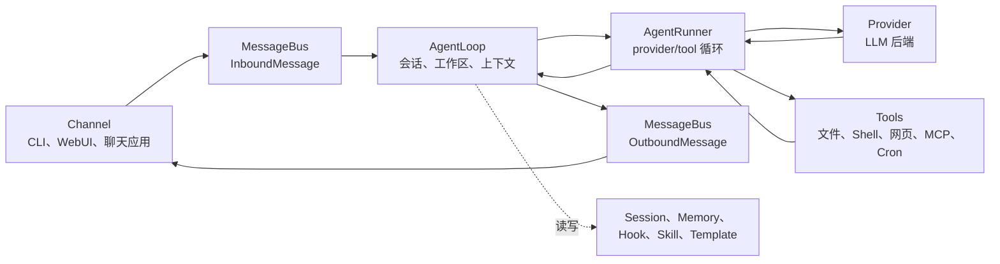

# 架构说明

本文档将 nanobot 的运行时行为映射到源文件。当你调试内部逻辑、审查 PR、添加 provider/channel/tool，或想了解某个用户可见行为从何而来时，请阅读本文。

如需产品层面的心智模型，请先阅读 [`核心概念.md`](./核心概念.md)。

## 核心流程



主要文件：

| 领域 | 文件 |
|---|---|
| 消息事件和队列 | `nanobot/bus/events.py`、`nanobot/bus/queue.py` |
| 回合编排 | `nanobot/agent/loop.py` |
| Provider/Tool 对话循环 | `nanobot/agent/runner.py` |
| 上下文构建 | `nanobot/agent/context.py` |
| Session 存储和压缩 | `nanobot/session/manager.py` |
| 长期记忆和 Dream | `nanobot/agent/memory.py` |

## AgentLoop 与 AgentRunner

`AgentLoop` 负责面向渠道的回合：

- 接收入站消息；
- 确定有效会话和工作区范围；
- 构建上下文；
- 连接 hook、progress 和渠道元数据；
- 发布出站消息。

`AgentRunner` 负责面向模型的循环：

- 将消息发送到选定的 provider；
- 处理流式 delta 和 reasoning 块；
- 执行工具调用；
- 将工具结果反馈给模型；
- 在生成最终答案或达到运行时限制时停止。

调试时记住这个划分。如果问题涉及渠道路由、会话 key、工作区选择或出站投递，从 `agent/loop.py` 开始排查。如果涉及 provider 调用、工具调用、流式输出或迭代限制，从 `agent/runner.py` 开始排查。

## Provider

Provider 元数据集中在 `nanobot/providers/registry.py`。配置字段位于 `nanobot/config/schema.py`。

Provider 选择使用：

- 显式的 `agents.defaults.provider` 或预设 provider；
- provider 注册表关键字；
- API key 前缀和 API base URL 提示；
- 配置了 `apiBase` 时的本地 provider 回退；
- 可路由多个模型系列的 gateway provider 回退。

Provider 实现位于 `nanobot/providers/`。大多数托管 provider 使用 OpenAI 兼容实现，而 Anthropic、Azure OpenAI、AWS Bedrock、OpenAI Codex 和 GitHub Copilot 有专门的适配路径。

相关文档：

- 实际设置参见 [`providers.md`](./providers.md)；
- 精确 provider 参考参见 [`configuration.md#providers`](./configuration.md#providers)。

## Channel

Channel 将外部平台转换为 `InboundMessage` 事件，并将 `OutboundMessage` 事件发回平台。

主要文件：

| 领域 | 文件 |
|---|---|
| Channel 基类契约 | `nanobot/channels/base.py` |
| 内置 Channel | `nanobot/channels/*.py` |
| 发现和生命周期 | `nanobot/channels/manager.py` |
| WebSocket/WebUI Channel | `nanobot/channels/websocket.py` |

Channel 通过内置模块扫描和插件入口点发现。自定义 Channel 应遵循 [`channel-plugin-guide.md`](./channel-plugin-guide.md)。

## WebUI 和 Gateway

`nanobot gateway` 启动：

- 已启用的聊天渠道；
- WebSocket 渠道（当配置时）；
- 工作区级别的 cron 服务；
- 系统任务，如 Dream 和 heartbeat；
- `gateway.port` 上的健康检查端点。

打包的 WebUI 由 WebSocket 渠道提供，而非健康检查端点：

| 入口 | 默认值 |
|---|---|
| 健康检查端点 | `http://127.0.0.1:18790/health` |
| WebUI/WebSocket | `http://127.0.0.1:8765` |

WebUI 源码位于 `webui/`。生产构建输出到 `nanobot/web/dist/` 并打包进 wheel。

相关文档：

- WebUI 使用和开发参见 [`../webui/README.md`](../webui/README.md)；
- 协议细节参见 [`websocket.md`](./websocket.md)。

## Tool

工具从 `nanobot/agent/tools/` 和插件入口点发现。

重要文件：

| 工具领域 | 文件 |
|---|---|
| Tool 基类和 Schema | `nanobot/agent/tools/base.py`、`nanobot/agent/tools/schema.py` |
| 发现 | `nanobot/agent/tools/registry.py` |
| Shell 执行 | `nanobot/agent/tools/shell.py` |
| 文件系统工具 | `nanobot/agent/tools/filesystem.py` |
| 网页搜索/抓取 | `nanobot/agent/tools/web.py` |
| MCP 工具 | `nanobot/agent/tools/mcp.py` |
| Cron | `nanobot/agent/tools/cron.py`、`nanobot/cron/` |
| 图片生成 | `nanobot/agent/tools/image_generation.py` |
| 运行时自省 | `nanobot/agent/tools/self.py` |

工具行为是模型契约的一部分。除非有意为之，否则保持用户可见的工具名称、schema 和错误信息稳定。

## 配置和路径

配置 schema 位于 `nanobot/config/schema.py`。加载和保存位于 `nanobot/config/loader.py`。运行时路径辅助位于 `nanobot/config/paths.py`。

默认值：

| 路径 | 默认值 |
|---|---|
| Config | `~/.nanobot/config.json` |
| Workspace | `~/.nanobot/workspace/` |
| Sessions | `<workspace>/sessions/*.jsonl` |
| Memory | `<workspace>/memory/` |
| Cron 存储 | `<workspace>/cron/jobs.json` |
| WebUI/媒体/日志运行时数据 | config 目录子目录，如 `webui/`、`media/`、`logs/` |

Schema 同时接受 camelCase 和 snake_case 键名，但保存配置时使用 camelCase 别名。

## Memory 和 Session

Session 历史是近期对话回放。Memory 是长期工作区状态。

| 存储 | 文件区域 |
|---|---|
| Session JSONL 文件 | `<workspace>/sessions/` |
| 长期 Memory | `<workspace>/memory/MEMORY.md` |
| 整合源历史 | `<workspace>/memory/history.jsonl` |
| Bootstrap 身份文件 | `<workspace>/SOUL.md`、`<workspace>/USER.md`、`nanobot/templates/` 下的模板 |

Dream 在 `nanobot/agent/memory.py` 中实现，启用时由运行时调度。

## 安全边界

涉及安全的代码路径包括：

| 边界 | 文件 |
|---|---|
| 工作区范围 | `nanobot/security/workspace_access.py`、`nanobot/security/workspace_policy.py` |
| Shell 沙箱 | `nanobot/agent/tools/shell.py` |
| SSRF/网络检查 | `nanobot/security/network.py`、`nanobot/agent/tools/web.py` |
| PTH 保护和 CLI 启动安全 | `nanobot/security/` 和 CLI 入口点 |
| Channel 访问控制 | `nanobot/channels/*.py` 中的渠道配置 |

修改工具、渠道、文件访问、WebUI 工作区行为或网络抓取时，将安全视为功能行为的一部分。如果面向用户的边界发生变化，请更新文档。

## 扩展点

| 扩展 | 方式 |
|---|---|
| Provider | 在 `providers/registry.py` 中添加 `ProviderSpec`，在 `config/schema.py` 中添加 schema 字段，仅在通用后端不足时才实现 provider |
| Channel | 实现 `BaseChannel`，暴露入口点，遵循 [`channel-plugin-guide.md`](./channel-plugin-guide.md) |
| Tool | 在 `agent/tools/` 下实现工具或暴露插件入口点 |
| MCP | 添加 `tools.mcpServers` 配置 |
| Skill | 在 `<workspace>/skills/` 添加工作区技能文件，或在 `nanobot/skills/` 添加内置技能 |

优先使用现有的注册表/发现模式，而非临时拼凑。

## 测试和验证

常用检查：

```bash
pytest tests/test_openai_api.py::test_function -v
ruff check nanobot/
cd webui && bun run test
cd webui && bun run build
```

根据修改范围选择测试：

| 修改 | 最低有效验证 |
|---|---|
| Provider 行为 | Provider 单元测试或模拟 API 路径；可行时用安全配置运行 `nanobot agent -m "Hello!"` |
| Channel 行为 | Channel 测试加上 `nanobot gateway` 启动路径 |
| WebUI 行为 | WebUI 测试/构建，路由/设置/聊天变更需通过 gateway 进行浏览器级验证 |
| Tool 行为 | Tool 单元测试，schema 或模型影响变更需 agent-run 路径 |
| 文档 | 链接检查、命令与 CLI/schema 的准确性、`git diff --check` |

对于面向用户的流程，建议至少通过用户实际接触的公开入口进行一次验证：CLI 命令、HTTP 端点、WebSocket/WebUI、聊天渠道或打包导入。
